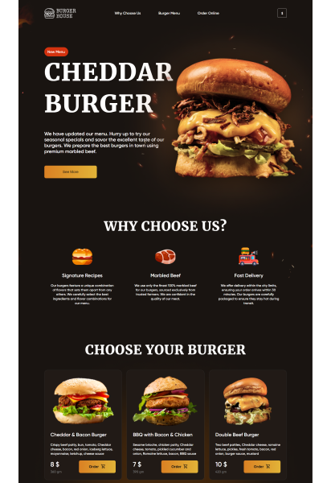
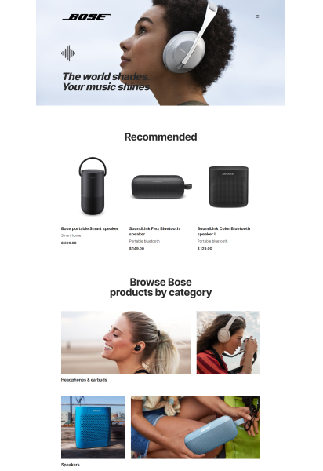
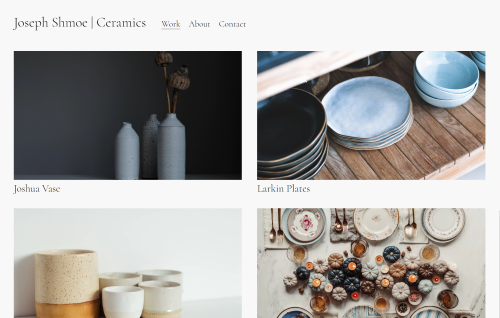
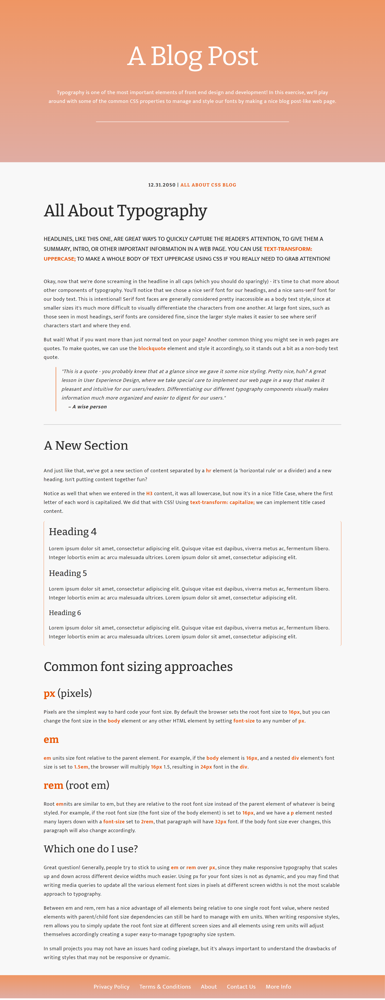

# Leila Bekirkhan

> Frontend Developer in Training
> *Cádiz, Spain*
>
> [](https://github.com/leila-bekirkhan/ "Go to GitHub") [](mailto:bekirkhan@gmail.com "Send an email") [](https://www.linkedin.com/in/leila-bekirkhan/ "Go to Linkedin") [](https://t.me/l_bekirkhan/ "Send a message on Telegram") [](https://wa.me/1234567890/ "Send a message on WhatsApp")

> Some info about me

## Skills

>  JavaScript (fundamentals)
>  HTML5 (semantic markup)
>  CSS3 (flex; grid; animations)
>  Markdown
>  VSCode (emmet; snippets)
>  Devtools
>  GitHub
>  Git
>  Figma

---

There is a **code example** from the [Burger House project](https://leila-bekirkhan-burger-house-landing.netlify.app/). _This code enables smooth scrolling to the "products" section when the "main action button" is clicked._

```javascript
document.getElementById("main__action__button").onclick = function() {
  document.getElementById("products").scrollIntoView({behavior: "smooth"});
}
```

## Some Projects
> * [**Burger House Landing Page**](https://leila-bekirkhan-burger-house-landing.netlify.app/)  
 [](https://leila-bekirkhan-burger-house-landing.netlify.app/ "Click to open")

> * [**Bose Landing Page**](https://leila-bekirkhan-bose-landing.netlify.app/ "Click to open")  
 [](https://leila-bekirkhan-bose-landing.netlify.app/ "Click to open") 

> * [**Joseph Shmoe Ceramics Portfolio**](https://leila-bekirkhan.github.io/HTML-CSS-projects/artist-portfolio-ceramics/ "Click to open")  
 [](https://leila-bekirkhan.github.io/HTML-CSS-projects/artist-portfolio-ceramics/ "Click to open")

> * [**Blog Post Typography**](https://leila-bekirkhan.github.io//HTML-CSS-projects/blog-post-typography/ "Click to open")  
 [](https://leila-bekirkhan.github.io//HTML-CSS-projects/blog-post-typography/ "Click to open")

## Education

## Certificates & Badges

## Languages

* Ukrainian (Native)
* Russian (Native)
* English (B1-B2)
* Spanish (A2-B1)
* Polish (A2-B1)
* Esperanto (B2)
